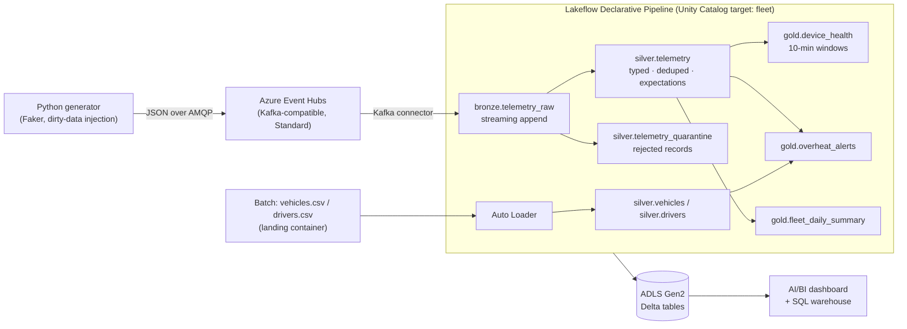

# Fleet Telemetry Lakehouse on Azure Databricks

An end-to-end **streaming lakehouse** built on the Azure free tier: synthetic vehicle
telemetry streams into Azure Event Hubs, is ingested by a **Lakeflow Declarative
Pipeline** (formerly Delta Live Tables) into a **medallion architecture** governed by
**Unity Catalog**, and lands as Delta tables on **ADLS Gen2** — all provisioned with
**Terraform** and destroyed with one command.

> Built for ~$0 using the Azure $200/30-day free credit and the Azure Databricks
> 14-day trial. Total build time: ~10–15 hours.

## Architecture



## What this demonstrates

**Streaming ingestion** from Event Hubs via the Kafka protocol into a declarative
pipeline. **Data quality as code** with expectations (`expect_or_drop`) plus an explicit
quarantine table for auditing rejected records. **Governance** with Unity Catalog:
managed storage through an Access Connector (no storage keys in code), catalog/schema
layout, and grants. **Infrastructure as Code** with two Terraform stacks (Azure infra,
then workspace-level Unity Catalog objects). **Cost engineering**: the whole thing runs
inside free-tier limits, with budget alerts and one-command teardown.

## Repository layout

```
├── terraform/
│   ├── azure/          # Stack 1: RG, ADLS Gen2, Event Hubs, Databricks workspace
│   └── databricks/     # Stack 2: storage credential, external location, catalog, schemas
├── generator/          # Telemetry producer (Event Hubs)
├── data/               # Batch dimension data generator (vehicles, drivers)
├── pipelines/          # Lakeflow Declarative Pipeline source (bronze/silver/gold)
├── scripts/            # Helper scripts (batch upload, secret scope setup)
└── docs/               # Architecture notes, screenshots
```

## Build order

### 1. Azure infra (Databricks OFF — don't start the 14-day trial yet)

```bash
cd terraform/azure
cp terraform.tfvars.example terraform.tfvars   # edit values
terraform init && terraform apply
```

### 2. Stream telemetry

```bash
cd generator
pip install -r requirements.txt
export EVENTHUB_CONNECTION_STR="$(cd ../terraform/azure && terraform output -raw generator_send_connection_string)"
export EVENTHUB_NAME=vehicle-telemetry
python produce.py
```

Verify events in the portal: Event Hubs namespace → *vehicle-telemetry* → Data Explorer.

### 3. Batch dimension data

```bash
python data/generate_batch_data.py            # writes data/out/vehicles.csv, drivers.csv
./scripts/upload_batch.sh                     # uploads to the landing container
```

### 4. Databricks workspace (trial clock starts now)

Set `enable_databricks = true` in `terraform/azure/terraform.tfvars`, re-apply, then:

```bash
cd terraform/databricks
cp terraform.tfvars.example terraform.tfvars   # paste outputs from stack 1
terraform init && terraform apply              # storage credential, external location, catalog, schemas
./scripts/setup_secrets.sh                     # secret scope with the Event Hubs listen connection string
```

### 5. Pipeline

Create a pipeline in the workspace (serverless if available, else smallest cluster),
source = a Git folder pointing at `pipelines/`, target catalog `fleet`. Use **triggered**
mode during development. Run the generator, trigger the pipeline, and watch the DAG and
expectation metrics.

### 6. Dashboard, screenshots, teardown

Build an AI/BI dashboard on the `gold` tables, capture screenshots into `docs/`, then:

```bash
cd terraform/databricks && terraform destroy
cd ../azure && terraform destroy
```

## Data quality results

*(screenshot placeholder: pipeline DAG + expectations metrics — ~5% of generated
records are deliberately malformed to exercise the quality gates)*

## Cost controls

Single-node `Standard_DS3_v2` clusters with 10–15 min auto-termination, triggered (not
continuous) pipeline mode, Event Hubs Standard at 1 TU with auto-inflate off, Azure
budget alerts at $50/$100/$150, and `terraform destroy` when done.
